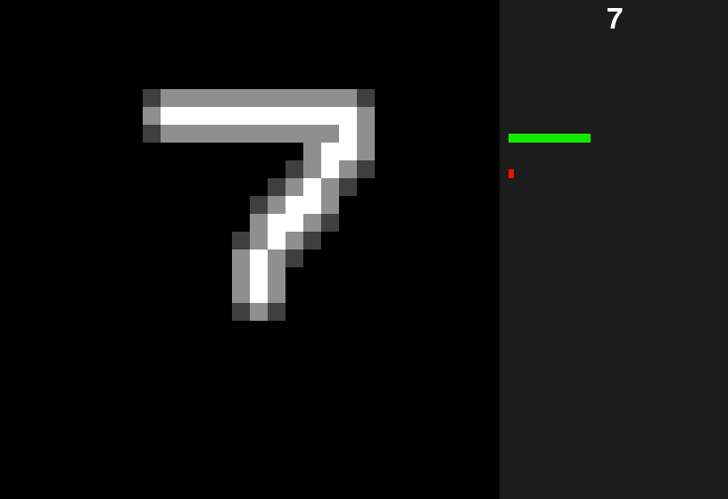
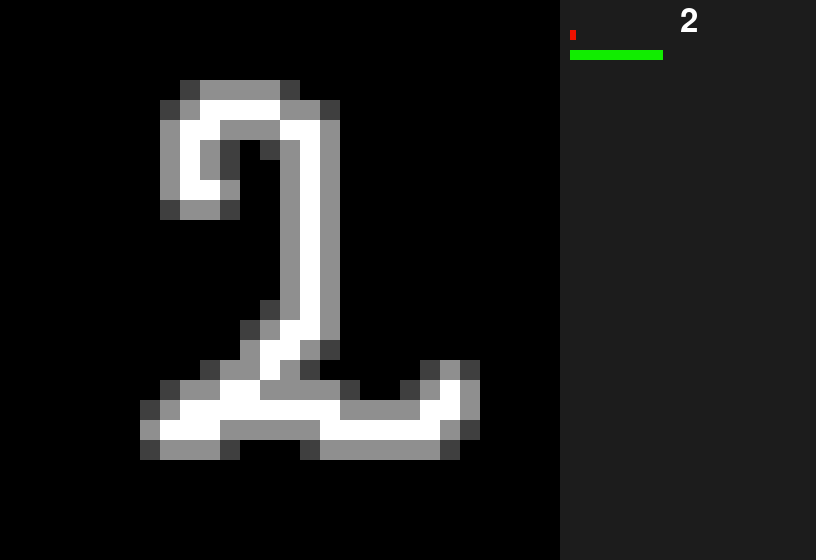
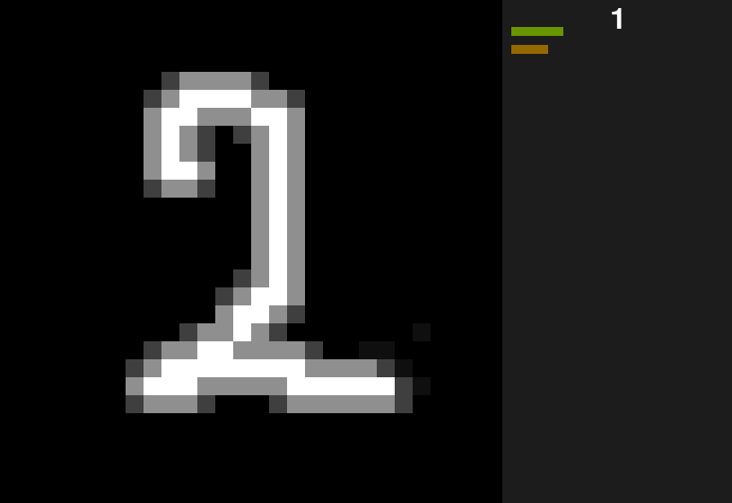

# Number definer using Neuron Network

This is a little project to learn how Neuron Network (NN) works.\
A task of define number is a classic task to start in AI.

In this repository there is a program for writing numbers using mouse and defining the number with NN.

----------------

### How to start

To start application run "App.py".\

#### Controls:
- Left Mouse Button -- drawing (on canvas area)
- Right Mouse Button -- cleaning (on canvas area)
- R button -- reset all canvas ("Reset" button on bottom panel doing same)
- "+" and "-" -- changing brush size

#### Interface

- Black area -- canvas for drawing (28x28 pixels)
- Bottom panel -- panel with controls and information (a bit empty)
- Side panel -- neuron network output and a selected number

#### Some issues

NN may incorrectly define number.\
To improve it you should write numbers near center of the canvas.

#### Needed modules

You need to have installed next modules:
- Python (of course)
- Numpy
- Pygame
- Matplotlib
- Tensorflow

---------------

### Images

  
Click to show

  

  

  

  

  ##### But:
  

---------------
### Files information

App.py -- the main file that start program.\
network.py -- the file with NN logic.\
training.py -- training NN.\
constants.py -- collect all constant value and sharing it.

canvas.py -- drawing canvas logic.\
control_panel.py -- side panel logic.\
network_panel.py -- NN output visualization.

folder "Array_Data" -- there are collected weights for NN works for different layers count and sizes.\
NN with 2 hidden layers with 50 neurons each is used in release version.

network_3_hid_layers.py -- testing with large number of hidden layers. Not used now.
